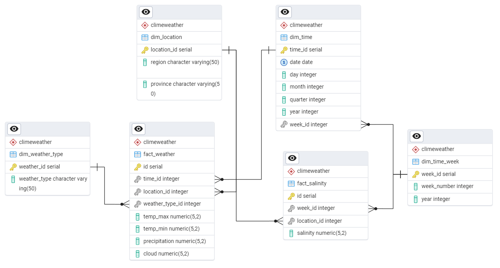

# Data houseware 

## Requirement

## General Structure
```css
[Data Sources] → [ETL (Apache NiFi)] → [Staging Area] → [Data Warehouse] → [BI Tools]
```

## Data Source

## Create Data houseware Schema on PostgreSQL

### Create new Database using pgADMIN
1. Open `pgAdmin`.
2. Go to `Object` => `Create` => `Database`.
3. Enter the database name (for example: `Climeweather_dw`).
4. Select encoding: `UTF8`.
5. Click `Save`.

### Write SQL to create schema and tables
Run [SQL queries](SQL/pgadmin_query/create_DW_schema.sql) in `pgAdmin`'s `Query Tool` to create Schema tables

### Insert sample data 
- Run [SQL queries](SQL/pgadmin_query/insert_DW_schema_sample_data.sql) to insert sample data into dimension tables
- Run [Python scripts](asset/dump_python_script) to insert sample data into fact tables

### Visualize ERD
1. Choose a table in `Object Explorer`
2. Click right-mouse button then choose `ERD for table`
The Schema for Data Warehouse is the same as this: 

## Design Staging Area
- Staging Area will store raw data from many different sources (weather API, IoT, satellite sensor) before entering Data Warehouse.
- Select Database for Staging Area
	- Use `PostgreSQL`
	- The data will be saved in the form of `JSONB` for flexibility.
	- There is an additional `Processed` column to mark the processed data or not.

### Create tables in Staging area
- Run [SQL queries](SQL/pgadmin_query/create_DW_staging_area.sql) in `pgAdmin`'s `Query Tool` to create Raw Staging Tables:	
	- Save all JSON data for flexibility when processing later.
	- `Processed` column is used to determine whether the data has been loaded into Data Warehouse or not.
- Run [SQL queries](SQL/pgadmin_query/create_DW_staging_area.sql) in `pgAdmin`'s `Query Tool` to create Cleaned Staging Tables

### Create summarized data tables

- Create summarized data tables by provinces and month
```sql
CREATE TABLE climeweather.aggregated_weather_province_month AS
SELECT 
    t.year, 
    t.month, 
    l.province, 
    AVG(f.temperature) AS avg_temp, 
    AVG(f.humidity) AS avg_humidity,
    AVG(f.wind_speed) AS avg_wind_speed
FROM climeweather.fact_weather f
JOIN climeweather.dim_time t ON f.time_id = t.time_id
JOIN climeweather.dim_location l ON f.location_id = l.location_id
GROUP BY t.year, t.month, l.province;

-- Add UNIQUE constraint after table creation
ALTER TABLE climeweather.aggregated_weather_province_month
ADD CONSTRAINT unique_year_month_province UNIQUE (year, month, province);
```

- Other tables...


## ETL (Extract-Transform-Load) Technology
`Apache Nifi` (Compatible with real-time data, provide visual interface) for ETL from Data Source to Staging Area

### Install and Start Apache Nifi (version 2.2.0)
1. Download Nifi: Visit the Apache NiFi Downloads page and choose the version suitable for your operating system (Windows, macOS, or Linux).
2. Extract the Files: Extract the `.zip` file.
3. Set up Java: Ensure you have Java 8 or Java 11 installed. Running `java -version` in terminal to check.
4. Configure NiFi: Navigate to the `conf` folder in the extracted NiFi directory. Edit the `nifi.properties` file to set up configurations like ports, repositories, and sensitive properties.
5. Start NiFi: Open Terminal then navigate to `bin` folder. Run `.\nifi.cmd start`.
6. Access the NiFi UI: Open a web browser and go to `https://localhost:8443/nifi` (default port).

### ETL Pipeline

#### ETL from Data Source to Staging Area 
- ETL from API to Staging Area 
	- Extract data from API to `staging_weather_raw` table
	- Process data from `staging_weather_raw` to `staging_weather_cleaned`
	- Update `processed` column in `staging_weather_raw` table
	

#### ETL from Staging Area to DWH
- Insert data from `staging_weather_cleaned` into `fact_weather`
- Delete data in `staging_weathe_cleaned` table

## DWH and OLAP Server

### Data

#### Detailed, granular data
Stored in `fact _weather` and dimetional tables

#### Aggregated or summarized data
Run [SQL queries](SQL/nifi_flow_query/update_summarized_data.sql) to summarize data in Nifi

## BI Tool

### Power BI
Power BI is a strong BI (Business Intelligence) tool, which helps you analyze and visualize data from Data Warehouse easily.

### Connect Power BI to PostgreSQL
1. Open `Power BI` → `Home` → `Get Data` → `More...`
2. Choose `Database` → `PostgreSQL database` → `Connect` 
3. Input connection information:
	- Server: `localhost:5432`
	- Database: `climeweather_dw`
4. Choose `DirectQuery`
5. Input username and password

### Query data from Data Warehouse
1. In `Home` → `Recent sources`
2. Choose PostgreSQL server that has been connected
3. Choose the data table that need to be used (the data can be Transformed before Loaded)

### Generate Report 