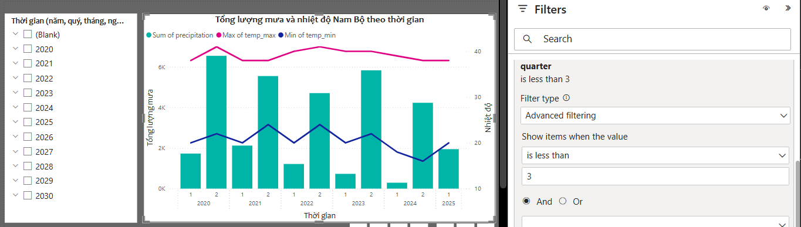

# Data Warehouse Design and Implementation

## Requirement

### Objectives
The Data Warehouse system aims to:
- Store and analyze weather data (temperature, humidity, rainfall, etc.).
- Store and analyze soil salinity data for different regions, provinces.
- Support decision-making in agriculture, particularly in mitigating climate change risks.

### Scope
- Geographical coverage: Southern Vietnam provinces only.
- Collected data:
	- Weather data
	- Soil salinity data
- Retention period: At least 4 years for trend analysis.
- Update frequency: Daily, weekly...

## General Structure
```css
[Data Sources] → [ETL (Apache NiFi)] → [Staging Area] → [Data Warehouse] → [BI Tools]
```

## Data Source
The data used in this project comes from 2 source:
- Weather data: collected daily through [MeteoSource API](https://www.meteosource.com/) and is provided in JSON format. It typically includes parameters such as temperature, humidity, precipitation, and other atmospheric conditions.
- Soil salinity data: obtained from a flat file in [CSV format](asset/dump_data/weekly_report/weekly_salinity_report.csv). This file serves as a weekly aggregation of soil salinity levels. This dataset is collected weekly from reports issued by the Southern Regional Hydrometeorological Center of Vietnam's [website](https://www.kttv-nb.org.vn/).

## Create Data houseware Schema on PostgreSQL

### Create new Database using pgADMIN
1. Open `pgAdmin`.
2. Go to `Object` => `Create` => `Database`.
3. Enter the database name (for example: `Climeweather_dw`).
4. Select encoding: `UTF8`.
5. Click `Save`.

### Write SQL to create schema and tables
Run [SQL queries](SQL/pgadmin_query/create_DW_schema.sql) in `pgAdmin`'s `Query Tool` to create Schema tables

### Insert sample data 
- Run [SQL queries](SQL/pgadmin_query/insert_DW_schema_sample_data.sql) to insert sample data into dimension tables
- Run [Python scripts](asset/dump_python_script) to insert sample data into cleaned staging area tables

### Visualize ERD
1. Choose a table in `Object Explorer`
2. Click right-mouse button then choose `ERD for table`

The Schema for Data Warehouse is the same as this: 

## Design Staging Area
- Staging Area will store raw data from many different sources (weather API, IoT, satellite sensor) and cleaned data before entering Data Warehouse.
- Type of Tables in Staging Area:
	- Raw data table: store un-processed data from Data Source
		- The data will be saved in the form of `JSONB` for flexibility.
		- There is an additional `Processed` column to mark the processed data or not.
	- Cleaned data table: store processed data, the data is ready to be imported into Data Warehouse 

### Create tables in Staging area
Run [SQL queries](SQL/pgadmin_query/create_DW_staging_area.sql) in `pgAdmin`'s `Query Tool` to create Raw data Staging Tables and Cleaned data Staging Tables

<!-- ## Summary Data
Summary Data refers to aggregated or pre-computed data in a Data Warehouse, designed to improve query performance and facilitate rapid analysis. Instead of repeatedly querying large, detailed datasets, users can work with condensed, pre-summarized information

### Create Summary Data tables
- Run [SQL queries](SQL/pgadmin_query/create_DW_summary_table.sql) to create summary data tables
- The tables contain summarized weather data by week and by month

### Insert sample Summary Data
Run [SQL queries](SQL/pgadmin_query/insert_DW_summary_table_data.sql) to insert summary data from fact tables
-->

## ETL (Extract-Transform-Load) Technology
`Apache Nifi` (Compatible with real-time data, provide visual interface) for ETL from Data Source to Staging Area

### Install and Start Apache Nifi (version 2.2.0)
1. Download Nifi: Visit the Apache NiFi Downloads page and choose the version suitable for your operating system (Windows, macOS, or Linux).
2. Extract the Files: Extract the `.zip` file.
3. Set up Java: Ensure you have Java 8 or Java 11 installed. Running `java -version` in terminal to check.
4. Configure NiFi: Navigate to the `conf` folder in the extracted NiFi directory. Edit the `nifi.properties` file to set up configurations like ports, repositories, and sensitive properties.
5. Start NiFi: Open Terminal then navigate to `bin` folder. Run `.\nifi.cmd start`.
6. Access the NiFi UI: Open a web browser and go to `https://localhost:8443/nifi` (default port).
7. Log in: username and password are automatically created by Nifi and stored in `logs/nifi-app.log`

### ETL Pipeline

#### ETL from Data Source to Staging Area 
- ETL weather data (import [processor](ApacheNifi_processor/1_Source_to_Staging/ETL_Weather_Data.json) into Nifi): execute every day
	- Extract: fetch weather data from API
	- Transform: change unit
	- Load: load transformed weather data into `staging_weather_raw` table
- ETL soil salinity data (import [processor](ApacheNifi_processor/1_Source_to_Staging/ETL_Salinity_Data.json) into Nifi): execute every week
	- Extract: fetch salinity data from CSV file ([weekly salinity report](asset/dump_data/weekly_report/weekly_salinity_report.csv))
	- Transform: replace missing values
	- Load: load transformed salinity data into `staging_salinity_raw` table

#### Process raw data in Staging Area
Process raw data in raw data tables. Tranform `JSONB` data into cleaned data then insert them into cleaned data tables. Execute every week (import [processor](ApacheNifi_processor/2_Process_in_Staging/Process_Data_in_Staging_Area.json)).
- Tranform raw weather data from `staging_weather_raw` table into cleaned weather data then insert into `staging_weather_cleaned` table using [Python script](Python_script/transform_raw_weather_data.py)
- Tranform raw salinity data from `staging_salinity_raw` table into cleaned salinity data then insert into `staging_salinity_cleaned` table using [Python script](Python_script/transform_raw_salinity_data.py)

#### ETL from Staging Area to DWH
Import [processor](ApacheNifi_processor/3_Staging_to_DWH/ETL_from_Staging_to_DWH.json), which use [Python scripts](Python_script) to process ETL into Nifi (execute every week)
- Extract: get cleaned data from `staging_weather_cleaned` and `staging_salinity_cleaned`
- Transform: handling missing data
	- Missing Weather data: use moving average to handle missing value (weather data is collected in a short time - every day) 
	- Missing Salinity data: label as missing value 
- Load: load transform data to fact tables 
- Delete cleaned data in `staging_weather_cleaned` and `staging_salinity_cleaned`

## BI Tool and OLAP operations

### Power BI
Power BI is a strong BI (Business Intelligence) tool, which helps you analyze and visualize data from Data Warehouse easily.

### Connect Power BI to PostgreSQL
1. Open `Power BI` → `Home` → `Get Data` → `More...`
2. Choose `Database` → `PostgreSQL database` → `Connect` 
3. Input connection information:
	- Server: `localhost:5432`
	- Database: `climeweather_dw`
4. Choose `DirectQuery` (Query directly from DB when opening the report)
5. Input username and password
6. In `Navigator` dialog box, select all tables that will be used and click `Load` (Since `DirectQuery` is chosen, Power Bi does not download data, but send SQL query to Postgresql whenever you change the filter, create charts, or open Dashboard - Loading data in this step is actually loading metadata)

### Data Model in Power BI
- OLAP works on the relational data model, so it is necessary to organize data under the Star Schema model or Snowflake Schema with the tables
- After loading tables, Power BI will automatically create Data Model. Change to `Model View`, the data model will be the same as follow


### Set up Hierarchies in Power BI
- Each dimension can have hierarchies, which define the levels of granularity. 
- Hierarchies allow users to drill down or roll up through levels of detail.
- Steps to set up Hierarchies:
	1. Select a dim table in `Model View`.
	2. Choose the hierarchy column (eg: Year, Quarter, Month, Day).
	3. Right-click on a column → `Create Hierarchy`.
	4. Name Hierarchy (eg: "Date Hierarchy").
	5. Pull other columns into Hierarchy to create decentralized level.


### Create charts in Power BI
1. Go to `Report View`
2. In `Visualizations`, select desired type of chart
3. Pull the columns into the chart in `Build visual`:
	- Axis (X axis)
	- Values ​​(Value)
	- Legend (classification)
	- ...
4. Format chart's and axis's titles in `Format visual` 

### OLAP Operations in Power BI 
When using `DirectQuery`, each OLAP operator on `Power Bi` will send one or more SQL queries to `Postgresql` to process data and return the results

1. **Roll-Up**
	- Insert a column chart (bar chart, line chart, matrix).
	- Pull Hierarchy into the X axis.
	- Press `Drill Up` to return to synthesis.

2. **Drill-Down**
	- Insert a column chart (bar chart, line chart, matrix).
	- Pull Hierarchy into the X axis.
	- Enable `Drill Down Mode` so you can explore data at different levels at a point on X axis
	- Press `Expand all down one level` so you can explore data at different levels at every point on X axis.


3. **Slice**
	- Go to `Visualizations` tab → Select `Slicer`.
	- Pull the column to filter into `Slicer` (eg: Year, Region, Category).
	- When choosing a value in `Slicer`, the report will automatically update.


4. **Dice**
	- Select a chart or data sheet.
	- Go to the `Filters` tab.
	- Add desired filtration conditions (eg: Category = 'Laptop', Region = 'Hanoi').


### Visualize Map in Power BI
1. Create GeoJSON file:
	- Download Vietnam GeoJSON file from [link](https://data.opendevelopmentmekong.net/dataset/a-phn-tnh) and save as [this GeoJSON file](asset/dump_data/geo_data/vietnam_province.geojson)
	- Run [Python script](asset/dump_python_script/filter_geojson_data.py) to filter [necessary provinces](asset/dump_data/geo_data/vietnam_southern_province.geojson)
2. Convert GeoJSON to TopoJSON: use this [website](https://mapshaper.org/)
3. Build the Shape Map visual
	- Drag the `Shape Map` to `Power BI Canvas`
	- Under the `Build` tab, drag `location` into the `Location Area`
	- Under the `Format` tab, expand `Map Setting`, set `Map type` to `Custom map` then select the saved TopoJSON file in `Add a map type`

For more specific instructions, please follow this [article](https://www.linkedin.com/pulse/creating-custom-shape-map-power-bi-vietnams-province-holt-nguyen/)

The result after visualize data fetching from Data Warehouse may be the same as follow:
